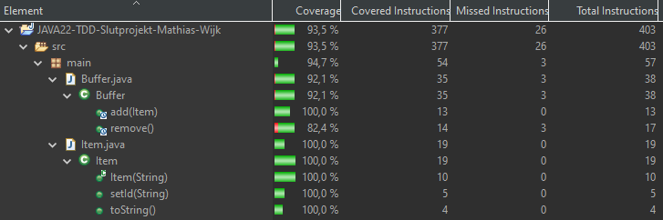

# JAVA22-TDD-Slutprojekt-Mathias-Wijk

I början hade jag lite problem och var osäker på hur jag skulle testa koden. Men efter jag gick igenom de tester vi redan har skrivit och undervisningarna kom jag på hur koden ska testas. 

Jag började med att skapa Mock klasser till dem klasser vi fick och sedan började jag med testerna. 

Jag skrev nästan alla item tester när jag började på buffer. Buffer testerna gick bra tills jag skulle testa remove() i buffer. Hela koden stannade och alla tester efter kördes inte. Sen dagen efter visade du hur man testar metoden med hjälp av en hjälp tråd. Detta fixade problemet och jag kom vidare.

Jag hade också problem med att testa console output men efter lite sökande så hittade jag en lösning som fungerar.

Efter det gick resten av testera bra utan några stora problem.

